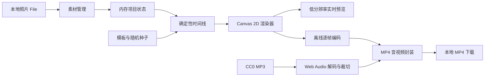

# MiniQuickCut 技术架构

版本：1.0 MVP  
更新日期：2026-07-10

## 1. 架构结论

MVP 采用 local-first 单页应用：照片管理、时间线生成、预览和 MP4 编码全部在浏览器完成。服务端只负责分发静态应用和内置音乐，不接收用户照片，也不创建项目记录。

选择这条路径的原因：流程短、隐私边界清晰、无渲染服务器成本，且固定 30 秒、720p、轻运镜的工作量适合 WebCodecs 硬件编码。

## 2. 系统视图



## 3. 应用分层

### 3.1 展示层

- React 客户端组件维护三步流程。
- 页面不使用传统后台侧栏，顶部步骤条表达当前阶段。
- 桌面为宽画布与控制面板组合；窄屏改为纵向排列。
- 视觉语言延续 ImgVideoFrame：暖灰背景、深色玻璃面板、16–24px 圆角、克制阴影、荧光青绿作为操作色。

### 3.2 项目状态层

```ts
type ProjectState = {
  step: "photos" | "style" | "preview"
  photos: PhotoItem[]
  ratio: "16:9" | "9:16" | "4:3" | "3:4"
  templateId: TemplateId
  seed: number
}
```

`PhotoItem` 保存文件、对象 URL、名称和稳定 ID。对象 URL 在照片移除或组件卸载时释放。项目不持久化到数据库或 IndexedDB。

### 3.3 模板层

模板是纯数据：布局模式、音乐池、最短镜头时长、色彩提示、转场时长、缩放区间、平移强度和运动偏好。BPM 与首拍偏移属于具体音乐，而不是模板全局属性。

```ts
type VlogTemplate = {
  id: TemplateId
  title: string
  music: Array<{ src: string; title: string; bpm?: number; beatOffset?: number }>
  layout: "cinematic" | "album" | "beat" | "book" | "minimal"
  minShotDuration: number
  transition: number
  zoomMin: number
  zoomMax: number
  panStrength: number
  motionBias: MotionType[]
}
```

### 3.4 时间线与随机数

使用可复现的伪随机生成器，输入为项目 seed 和照片索引。每个镜头独立派生参数，避免调整前一张照片后所有后续参数不可预测地漂移。

在生成时间线前，系统先把每张图片缩至 9×8，计算 64 位 dHash 与平均 RGB。近重复图片可被省略，但不少于 10 张；若素材多于模板容量，使用最远点策略优先保留视觉差异。随后只在相邻相似度过高时交换后续照片，尽量保留用户的大体顺序。

每首音乐分别记录实测 BPM 与首拍偏移。时间 `t` 先映射到当前音乐的拍位，再按照片数分配完整拍段，因此五套模板更换音乐后都会重新计算切点，而不是沿用另一首歌的时间线。`beat` 模板在拍点硬切；其余模板在拍点前开始缓出，并恰好在拍点完成转场。预览与导出都调用同一个 `prepareImageSequence` 和 `renderFrame(t)`。

活力模板的两首音乐分别使用离线测得的 92 BPM / 0.28 秒和 91 BPM / 0.60 秒。切图边界由整数拍推导，逐拍推进使用指数衰减脉冲，每四拍标记为强拍。当前版本不在用户设备上重复分析音频。

### 3.5 Canvas 渲染层

Canvas 2D 提供五个轻量渲染策略：

- `cinematic`：全屏 cover、Ken Burns 运镜和交叉淡化。
- `album`：模糊环境背景与完整照片相纸；每张从五种左右/上下滑入方式、独立旋转角度、尺寸和缓出方向中确定性随机选择。
- `beat`：全屏/横幅/竖版海报轮换、整数拍硬切、逐拍 punch zoom 和四拍重音闪白。
- `book`（界面名“翻页手记”）：每两张照片组成一个 spread，循环使用跨页大图、左右双图和画册拼贴。每张单页采用 `1.55:2.16` 竖版比例，两页摊开后形成接近方形的画册。Three.js 使用 32×10 分段纸张网格；顶点着色器以书脊为原点，根据翻页进度旋转并弯曲每个顶点，片元着色器根据正反面分别采样当前右页和下一左页。照片页使用不参与场景光照的基础材质，翻页着色器也不向图片叠加明暗滤镜；立体感由纸张形变、厚度和独立软投影提供，并在音乐完整拍点完成翻页。
- `minimal`：完整照片、米白留白，并随机变化左右构图、进度标记方向、照片尺寸和呼吸方向。

五个策略共享同一时间线入口和图片资源。仅翻页手记使用一个复用的 Three.js WebGLRenderer；其余模板仍为 Canvas 2D。WebGL 画布开启 `preserveDrawingBuffer`，每帧渲染后同步合成到共享 2D Canvas，因此预览和 MP4 导出仍使用同一时间线与最终画面。纹理按照片和版式缓存，渲染器只创建一次，避免逐帧分配 GPU 资源。

文字层借鉴场景/overlay 分离的思路，但压缩为一个轻量 `VlogTextContent`：封面标题、中段短句、结尾落款。每套模板内置文案和独立排版语言，统一传入共享 `renderFrame`；绘制器分别在约 0.15–5.2 秒、12.2–16.4 秒和 26–30 秒渲染三段内容。所有动画只依赖当前时间，因此暂停、跳转、预览与逐帧导出的结果始终一致。

此处参考 OpenMontage 将 `hero_title`、`text_card`、`section_title` 作为独立场景/覆盖层调度的做法，但不引入其 Remotion、场景注册表或生产管线，以维持浏览器 Canvas 2D 的低资源目标。

安全构图算法：

1. 计算 cover 基础缩放。
2. 叠加模板 overscan。
3. 计算缩放图像相对画布的水平、垂直剩余量。
4. 将起止偏移限制在剩余量以内。
5. 使用 smoothstep 缓动插值。

### 3.6 预览层

- Canvas 使用较小内部分辨率，CSS 负责适配显示区域。
- `HTMLAudioElement` 是预览时钟；画面按 `audio.currentTime` 绘制。
- 拖动进度条时同时更新音频时间和画面。
- 模板、比例或 seed 改变时回到 0 秒重新绘制。

### 3.7 导出层

导出使用 Mediabunny：

1. 检查浏览器是否能编码 AVC/H.264。
2. 缺少原生 AAC 编码时注册 `@mediabunny/aac-encoder`。
3. 创建目标尺寸 Canvas 和 `CanvasSource`。
4. 加载模板 MP3，通过 Web Audio 解码并裁切到 30 秒，首尾淡化。
5. 使用 `AudioBufferSource` 编码 AAC 音轨。
6. 以 24fps 循环调用共享 `renderFrame`，每帧 await 编码背压。
7. 封装为 MP4，生成 Blob 并下载。

导出分辨率：1280×720、720×1280、960×720、720×960。视频码率约 3.2Mbps，音频 128kbps，关键帧间隔 2 秒。

## 4. 关键依赖

- React / vinext：界面和 Sites 运行时。
- lucide-react：一致的界面图标。
- mediabunny：WebCodecs 封装、H.264/AAC 编码接入和 MP4 mux。
- @mediabunny/aac-encoder：AAC 原生能力缺失时的浏览器补齐。

不使用 FFmpeg.wasm、WebGL、WebGPU 或后端 FFmpeg。它们对当前四种轻运动没有必要，并会增加下载体积、内存或基础设施复杂度。

## 5. 错误处理

- 照片错误：按文件反馈，不中断已选列表。
- 音乐失败：阻止导出并建议刷新；预览可静音继续。
- H.264 不支持：保留预览，提示改用最新版 Chrome、Edge 或 Safari。
- 编码异常：取消 Output，释放资源并保留项目状态。
- 页面离开：依赖浏览器回收编码器；组件主动撤销对象 URL。

## 6. 安全与隐私

- 没有文件上传接口。
- 不记录文件名、照片内容或生成结果。
- 只加载同源内置音乐，避免跨域与跟踪请求。
- 文件下载通过浏览器 Blob URL 触发。
- Hosting 配置不声明 D1 或 R2。

## 7. 兼容性策略

应用加载时不阻止用户预览；仅在导出时检测编码能力。WebCodecs 规范允许浏览器支持任意 codec 组合，因此不能只检测 `VideoEncoder` 是否存在，必须检测 AVC 配置本身。

推荐环境为最新版 Chrome、Edge、Safari。Firefox 或旧版浏览器若缺少 AVC 编码，仍保留照片管理和 Canvas 预览。

## 8. 测试策略

- 单元级：seed 可复现、时间到镜头映射、双音乐 BPM 拍点边界、近重复剔除、相似照片分散、比例尺寸、防黑边偏移边界。
- 组件级：数量限制、删除替换、拖动排序、步骤守卫。
- 构建级：TypeScript 编译和 Worker/浏览器包兼容。
- 手工验收：四比例、10/20 张、横竖混合照片、五模板、每模板双音乐、重新生成、下载 MP4。

## 9. 部署

项目使用 `.openai/hosting.json` 和 Sites 兼容的 vinext 构建。无数据库迁移、对象存储或运行时密钥。构建产物由 Cloudflare Worker 兼容的 ESM 服务。
